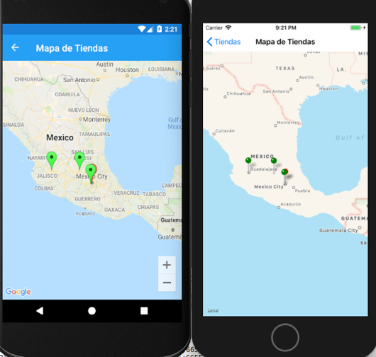

# Módulo 9 – Mapas y ubicación

### Preparando el proyecto 

1.	Un proyecto Xamarin.Forms en blanco con los siguientes paquetes NuGet en los tres proyectos.

-	Xamarin.Forms.Maps
-	Xamarin.Essentials (hay que activar la opción de mostrar pre-release)

Para este ejemplo se utilizan las últimas versiones de Xamarin.Forms al momento (3.2.0.599850) al igual que se instalan las últimas versiones de los paquetes mencionados.

Después de instalarlos hay que inicializarlos de la siguiente manera.

-	En Android dentro del MainActivity.cs se agregan las siguientes líneas en el método OnCreate antes de la inicialización de Xamarin.Forms

Xamarin.FormsMaps.Init(this,bundle);
Xamarin.Essentials.Platform.Init(this, bundle); 

Y de debe agregar lo siguiente dentro de la misma clase

public override void OnRequestPermissionsResult(int requestCode, string[] permissions, [GeneratedEnum] Permission[] grantResults)
        {
            Xamarin.Essentials.Platform.OnRequestPermissionsResult(requestCode, permissions, grantResults);
            base.OnRequestPermissionsResult(requestCode, permissions, grantResults);
        } 

Se debe generar una llave en https://cloud.google.com/maps-platform/ como se comento en el vídeo de la lección.

Posteriormente en el Manifiesto de Android se agregan las siguientes líneas referentes a los permisos requeridos, las líneas van fuera de la etiqueta application.

```
<uses-permission android:name="android.permission.ACCESS_COARSE_LOCATION" />
    <uses-permission android:name="android.permission.ACCESS_FINE_LOCATION" />
    <uses-feature android:name="android.hardware.location" android:required="false" />
    <uses-feature android:name="android.hardware.location.gps" android:required="false" />
    <uses-feature android:name="android.hardware.location.network" android:required="false" /> 

```
Y dentro de la etiqueta application del mismo archivo se agrega la llave dentro de esta etiqueta 

```
<meta-data android:name="com.google.android.maps.v2.API_KEY" android:value="Llave" />

```     

-	Para iOS es mas simple, se debe agregar la siguiente inicialización en el AppDelegate antes de la de Xamarin.Forms dentro del método FinishedLaunching
Xamarin.FormsMaps.Init(); 

Y en el archivo Info.plist hay que agregar el permiso de ubicación, el texto puede ser cualquier tomando en cuenta que es el que va a ser mostrado al usuario antes de obtener la ubicación.

### Comenzando con el código

1.	 Dentro del proyecto .NET Standard crea una carpeta “Classes” y dentro una clase llamada “Store” con el siguiente contenido

```
        public class Store
    {
        public string Name
        {
            get;
            set;
        }

        public string Address
        {
            get;s
            set;
        }

        public string Photo
        {
            get;
            set;
        }

        public Store(string name, string address, string photo)
        {
            this.Address = address;
            this.Name = name;
            this.Photo = photo;
        }
    } 

```

2.	Dentro de la misma carpeta crea una clase “StoreCatalog” donde se creará una lista con datos precargados que incluyen datos ficticios de una serie de tiendas.

Lo ideal es que modifiques las direcciones para que sean de tu país, ya que estas se utilizaran para ser mostradas en el mapa junto con tu ubicación.

```
using System.Collections.Generic;
using System.Collections.ObjectModel; 

```

```
public class StoresCatalog 
    {
        private static ReadOnlyCollection<Store> stores;

        public static ReadOnlyCollection<Store> Stores
        { 
        
            get
            {
                if(stores == null)
                {
                    stores = new ReadOnlyCollection<Store>(
                        new List<Store>
                    {
                        new Store("Tienda Querétaro","Av. del Sol, 1,El Sol, 76113 Santiago de Querétaro, Qro., México","https://placeimg.com/640/800/any"),
                        new Store("Tienda Sonora","Av. Nainari 112, Norte, Urb. No. 4, 85040 Cd Obregón, Sonora","https://placeimg.com/640/800/architecture"),
                        new Store("Tienda CDMX","Av. Prolongación Paseo De La Reforma No.400, Alvaro Obregon, Distrito Federal, CP 01210, México","https://placeimg.com/640/800/nature"),
                        new Store("Tienda Jalisco","Av Lapizlázuli 3390, Victoria, 44560 Zapopan, Jalisco","https://placeimg.com/640/800/tech"),
                    } 
                    );
                }

                return stores;
            }
        }
    } 

```

3.	Ahora al nivel del proyecto agrega una carpeta “Views” con las siguientes páginas XAML.

a.	StoresPage

Este es el contenido que va dentro de la etiqueta ContentPage en el XAML, el cual genera
-	Un ToolbarItem que permite navegar al mapa
-	Una lista que muestra los datos de las tiendas que se definieron en el catálogo. 


```
<ContentPage.ToolbarItems>
        <ToolbarItem Text="Mapa" Clicked="tbMap_Clicked" />
    </ContentPage.ToolbarItems>
    <ContentPage.Content>
         <ListView x:Name="lvStores" RowHeight="100" SelectionMode="None" >
            <ListView.ItemTemplate>
                <DataTemplate>
                    <ViewCell>
                       
                        <Grid>
                            <Grid.ColumnDefinitions>
                                <ColumnDefinition Width="75" />
                                <ColumnDefinition />
                            </Grid.ColumnDefinitions>
                            <Grid.RowDefinitions>
                                <RowDefinition Height="20" />
                                <RowDefinition Height="80" />
                            </Grid.RowDefinitions>
                            <Image Source="{Binding Photo}"  HorizontalOptions="Center" HeightRequest="90" WidthRequest="50" Grid.Row="0" Grid.Column="0" Grid.RowSpan="2" />
                            <Label FontSize="Medium" FontAttributes="Bold" VerticalOptions="Center" Grid.Column="1" Text="{Binding Name}" Grid.Row="0" />
                            <Label FontSize="Small" VerticalOptions="Start" Grid.Column="1" Text="{Binding Address}" Grid.Row="1" />
                        </Grid>
                    </ViewCell>
                </DataTemplate>
            </ListView.ItemTemplate>
        </ListView>
    </ContentPage.Content> 

```
 
Dentro de StoresPage.xaml.cs este es el contenido para cargar los datos y permitir la navegación.

```
public StoresPage()
        {
            InitializeComponent();
            lvStores.ItemsSource = Classes.StoresCatalog.Stores;
        }

        public async void tbMap_Clicked(object sender, EventArgs e)
        {
           await Navigation.PushAsync(new Views.StoreMapPage());
        } 

```

4.	Ahora modifica el archivo App.xaml.cs para cambiar la página de inicio, de modo que ahora será nuestra página StoresPage dentro de una NavigationPage

```
public App()
        {
            InitializeComponent();
            MainPage = new NavigationPage(new Views.StoresPage());
        }

```
Si todo va de acuerdo al manual este debe ser el resultado al iniciar la app, como no hemos creado la página StoreMapPage esta línea dará un error “await Navigation.PushAsync(new Views.StoreMapPage());”, para probar se puede comentar de forma temporal. 


5.	Dentro de la carpeta Views crea una nueva página XAML llamada StoreMapPage, este es el contenido.

En el archivo StoreMap.xaml dentro de la etiqueta ContentPage solo va un elemento

```
<maps:Map x:Name="mapStore"/> 
```
Para que funcione debemos agregar el namespace a nuestra etiqueta ContentPage

```
xmlns:maps="clr-namespace:Xamarin.Forms.Maps;assembly=Xamarin.Forms.Maps" 

```

Dentro del archivo StoreMapPage.xaml.cs agregaremos varios métodos y los siguientes namespace
using System.Threading.Tasks;
using Xamarin.Forms.Maps;
using Xamarin.Essentials;
using System.Linq; 

El primero para obtener la ubicación del usuario utilizando la clase Geolocation dentro de Xamarin.Essentials.

```
async Task<Position> GetUserPosition()
        {
            try
            {
                GeolocationRequest geolocationRequest = new GeolocationRequest(GeolocationAccuracy.Best, TimeSpan.FromSeconds(5));
                var userPosition = await Geolocation.GetLocationAsync(geolocationRequest);
                return new Position(userPosition.Latitude, userPosition.Longitude);
            }
            catch (FeatureNotSupportedException fnsEx)
            {
                await DisplayAlert("Error", "El dispositivo no soporta el uso de la ubicación", "Aceptar");
            }
            catch (PermissionException pEx)
            {
                await DisplayAlert("Error", "Es necesario tener permisos de uso de la ubicación", "Aceptar");
            }
            catch (Exception ex)
            {
                await DisplayAlert("Error", "Error desconocido", "Aceptar");
            }

            return default(Position);
        }  
```

Otro método mas para obtener las coordenadas de nuestras tiendas usando como referencia su dirección que tenemos en texto

```
async Task<Position> GetAddressPosition(string address)
        {
            var location = (await Geocoding.GetLocationsAsync(address))?.First();
            if (location != null)
            {
                return new Position(location.Latitude, location.Longitude);
            }

            return default(Position);
        }  

```

Finalmente, un método mas que se encarga de invocar a los dos metodos anteriores para posteriormente centrar el mapa en nuestra ubicación y agregar los marcadores de cada lugar.

```
async Task InitMap()
        {

            var userPosition = await GetUserPosition();

            if(userPosition != default(Position))
            {
                mapStore.Pins.Add(new Pin()
                {
                    Position = userPosition,
                    Label = "Mi ubicación" 
                });
            }

            mapStore.MoveToRegion(MapSpan.FromCenterAndRadius(userPosition, Distance.FromKilometers(1000)));

            foreach (var store in Classes.StoresCatalog.Stores)
            {
                var storePosition = await GetAddressPosition(store.Address);

                if (storePosition != default(Position))
                {
                    mapStore.Pins.Add(new Pin()
                    {
                        Position = storePosition,
                        Label = store.Name 
                    });
                }
            }
}
```

Lo único que hace falta agregar es la invocación a este método desde el constructor de la página

```
public StoreMapPage()
        {
            InitializeComponent();
            InitMap();
        } 
```
Al ejecutar el resultado de esta segunda página debe verse parecido al siguiente.


Cuando se hace uso del Emulador de Android debemos definir las coordenadas ficticias que se utilizaran durante las pruebas y se debe presionar el botón “SEND” 


En el caso de utilizar el simulador de iOS las coordenadas se definen desde el menú “Debug” en la opción “Location”, ahí podemos poner alguna de las opciones predefinidas o elegir la opción “Custom Location” para poner las que deseemos.
 
 
 
 ### Extendiendo el mapa

Como se explico en el vídeo el mapa de Xamarin.Forms por si solo es muy limitado. Para poder sacar provecho de este control debemos hacer uso de Custom Renderers lo cual nos obliga a aprender sobre como funcionan los mapas con sus APIs nativas.

En este ejemplo revisaremos uno de los escenarios mas simples, agregar un marcador con un color. Aunque el ejemplo es simple es muy similar a lo que hay que hacer cuando queremos hacer cosas mas complejas como mostrar rutas o marcar cierta área geográfica utilizando un circulo.


1.	El primer paso es crear un nuevo control, para esto agrega una carpeta “Controls” a tu proyecto .NET Standard y dentro de esta crea una clase llamada “ColorMap”, lo único que tiene de especial es que hereda de la clase Map de Xamarin.Forms.

Dentro del mismo archivo o en uno separado puedes agregar una clase ColorPin que hereda de la clase Pin de Xamarin.Forms

```
using Xamarin.Forms;
using Xamarin.Forms.Maps; 

```

```
public class ColorPin : Pin
    {
        public Color PinColor
        {
            get;
            set;
        }
    }

    public class ColorMap : Map
    {
    } 

```
2.	Dentro del proyecto Android crea una clase “ColorMapRenderer” dentro de una carpeta “Renderers”
El contenido es el siguiente

```
using Android.Content;
using Android.Gms.Maps.Model;
using UbicacionMapas.Controls;
using Xamarin.Forms.Maps;
using Xamarin.Forms.Maps.Android;
using Xamarin.Forms.Platform.Android;
using UbicacionMapas.Droid.Renderers;   //Usa el de tu proyecto
using Xamarin.Forms; 

```


```
public class ColorMapRenderer : MapRenderer
    {

        public ColorMapRenderer(Context context) : base(context)
        {
        }

        protected override void OnElementChanged(Xamarin.Forms.Platform.Android.ElementChangedEventArgs<Map> e)
        {
            base.OnElementChanged(e);

            if (e.NewElement != null) 
                Control.GetMapAsync(this);
        }

        //Este método se invoca cada que un marcador se agrega al mapa
        //Nosotros interceptamos la acción y modificamos el color
        //Las demás propiedades del Pin se respetan
        protected override MarkerOptions CreateMarker(Pin pin)
        {
            var colorPin = pin as ColorPin;
            var marker = new MarkerOptions();
            marker.SetPosition(new LatLng(pin.Position.Latitude, pin.Position.Longitude));
            marker.SetTitle(pin.Label);
            marker.SetSnippet(pin.Address);
            marker.SetIcon(GetMarkerIcon(ColorExtensions.ToAndroid(colorPin.PinColor)));
            return marker;
        }

        public BitmapDescriptor GetMarkerIcon(global::Android.Graphics.Color color)
        {
            float[] hsv = new float[3];
            global::Android.Graphics.Color.ColorToHSV(color, hsv);
            return BitmapDescriptorFactory.DefaultMarker(hsv[0]);
        }
    } 

```
Para que funcione debemos registrar el Renderer utilizando esta línea antes del namespace

```
[assembly: ExportRenderer(typeof(ColorMap), typeof(ColorMapRenderer))] 

```
3.	El proceso en iOS es similar, hay que agregar el Renderer con el siguiente contenido

```
using System.Linq;
using CoreLocation;
using MapKit;
using UbicacionMapas.Controls;
using UbicacionMapas.iOS.Renderers;
using UIKit;
using Xamarin.Forms;
using Xamarin.Forms.Maps;
using Xamarin.Forms.Maps.iOS;
using Xamarin.Forms.Platform.iOS; 

```

```
//Esta clase de apoyo sirve para convertir nuestro Pin de Xamarin Forms a una native con soporte a un color
public class ColorPointAnnotation : MKPointAnnotation
    {
        public UIColor Color
        {
            get;
            private set;
        }

        public ColorPointAnnotation(UIColor color)
        {
            Color = color;
        }
    }

    public class ColorMapRenderer : MapRenderer
    {
        public ColorMap ColorMap => Element as ColorMap;

        protected override void OnElementChanged(ElementChangedEventArgs<Xamarin.Forms.View> e)
        {
            base.OnElementChanged(e);

            if (e.OldElement != null)
            {
                var nativeMap = Control as MKMapView;
                if (nativeMap != null)
                {
                    nativeMap.RemoveAnnotations(nativeMap.Annotations);
                    nativeMap.GetViewForAnnotation = null;
                }
            }

            if (e.NewElement != null)
            {
                var formsMap = (ColorMap)e.NewElement;
                var nativeMap = Control as MKMapView;
   //La siguiente línea indica el método encargado de crear los marcadores 
                nativeMap.GetViewForAnnotation = GetViewForAnnotation;
            }
        }

        MKAnnotationView GetViewForAnnotation(MKMapView mapView, IMKAnnotation annotation)
        {
            var position = new Position(annotation.Coordinate.Latitude, annotation.Coordinate.Longitude);
            var colorPin = ((ColorMap)Element).Pins.Where(x => x.Position == position).First() as ColorPin;
            //Las siguientes líneas son las encargadas de reemplazar el Pin actual por uno de nuestra clase nativa con soporte para el color
var colorAnnotation = new ColorPointAnnotation(colorPin.PinColor.ToUIColor())
            {
                Title = colorPin.Label,
                Subtitle = colorPin.Address,
                Coordinate = new CLLocationCoordinate2D(colorPin.Position.Latitude, colorPin.Position.Longitude)
            };

            MKPinAnnotationView view = null;
            if (colorAnnotation != null)
            {
                var identifier = "colorAnnotation";
                view = mapView.DequeueReusableAnnotation(identifier) as MKPinAnnotationView;
                if (view == null)
                {
                    view = new MKPinAnnotationView(colorAnnotation, identifier);
                }

                view.Annotation = colorAnnotation;
                view.CanShowCallout = true;
                view.PinTintColor = colorAnnotation.Color;

            }
            return view;
        }
    } 

```

Al igual que en Android debemos registrar el Renderer antes de definir el namespace

```
[assembly: ExportRenderer(typeof(ColorMap), typeof(ColorMapRenderer))] 

```
4.	Ya tenemos nuestro control que soporta marcadores de color ahora es necesario conectarlo con nuestro proyecto que aún hace uso del control Map de Xamarin.

El cambio es simple, en la página StoreMapPage.xaml solo se debe modificar lo siguiente

```
<maps:Map x:Name="mapStore"/> 

```
Por

```
<maps:ColorMap x:Name="mapStore"/> 

```
Y el namespace

```
xmlns:maps="clr-namespace:Xamarin.Forms.Maps;assembly=Xamarin.Forms.Maps" 

```
Por esta línea tomando en cuenta el namespace de tu proyecto

```
xmlns:maps="clr-namespace:LeccionMapasUbicacion.Controls" 

```
Dentro de StoreMapPage.xaml.cs hay que agregar la definición de los colores que usaremos, cambiando de Pin a ColorPin y asignando el color, quedando de la siguiente manera el código al agregar el Pin.

```
using UbicacionMapas.Controls; 

```
```
mapStore.Pins.Add(new ColorPin()
                {
                    Position = userPosition,
                    Label = "Mi ubicación",
                    PinColor = Color.Red
                }); 

```
```
mapStore.Pins.Add(new ColorPin()
                    {
                        Position = storePosition,
                        Label = store.Name,
                        PinColor = Color.Green
                    }); 

```
Hecho el cambio el resultado debe ser el siguiente

 

**Nota: El color negro (Color.Black) no funciona en Android y el marcador se muestra rojo.**


